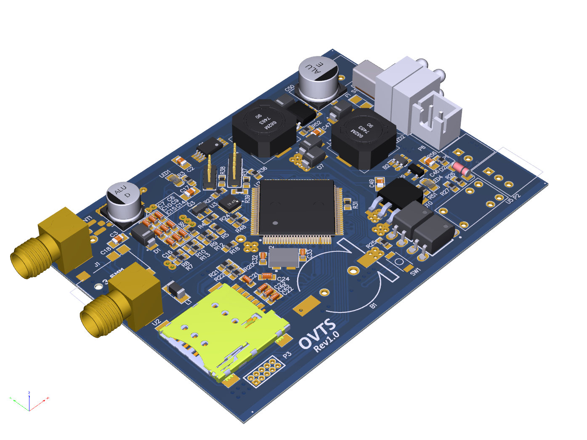

# Open Vehicle Tracking System

## OVTS Overview

[OVTS](https://github.com/Open-VTS) is an Open-source Vehicle Tracking System project based on GPS. It can track the device based on GPS data and send information to the main server (AKA Center). It can be mounted on a car or any other vehicles. The communication is over on GPRS and SMS. The device has other features like output relay, input voltage sensor, IMU sensor, etc. This project covers **Device-side**, **Server-side** and a **User Panel**.

This project is open source and is independent on **ANY ONLINE SERVICES**.

The project consists of four separate repositories:

* [OVTS-Device](https://github.com/Open-VTS/OVTS-Device)
* [OVTS-Server](https://github.com/Open-VTS/OVTS-Server)
* [OVTS-Panel](https://github.com/Open-VTS/OVTS-Panel)
* [OVTS-CenterApp](https://github.com/Open-VTS/OVTS-CenterApp)

## OVTS-Device

OVTS-Device is the device application of [OVTS](https://github.com/Open-VTS) project. This repo contains device application and hardware schematics and PCB gerber files for device manufacturing.

## OVTS-Device Features

* Small Dimensions 80mm x 58mm x 6mm (HWD).
* High processing power based on ARM Cortex-M4 STM32F407.
* Communication over HTTP/HTTPS, SMS message and both (DUAL Mode).
* Internal reporting system.
* Wide supply voltage range from 9V to 36V.
* Nine-Axis (Gyro + Accelerometer + Compass) IMU sensor.
* Built-in relay to turn on/off the vehicle or other devices.
* Input voltage sensor to detect vehicle start mechanism.
* Built-in RTC (Real Time Clock).
* Built-in SDCard.
* Built-in Lithium battery with onboard charger (lasts about 6 Hours).
* Sleep mode to save power.
* Audio Jack for phone call (in progress).
* Expansion onboard headers for further developments.
* Totally open source based on ARM mbed framework.
* Robust circuit and PCB design.
* Fully customizable with Desktop App without need to reprogram device (in progress).
* Work with GPS and AGPS (in progress).
* Wide operating temperature -30~85 °C (may vary based on hardware components).
* Works with a wide range of 3.7v Lithium Batteries (Lithium-polymer and Lithium-ion).
* And many more features for functionality and reliability of the system.

## Hardware Specifications

* Supply voltage circuit based on Ti TPS5430/50 DC/DC switching regulator.
* 3.7v Lithium charger circuit based on Microchip's MCP73831.
* Based on STM32F407VG a High-performance ARM Cortex-M4 chip.
* Developed based on ARM mbed-os.
* Onboard 5v Miniature Relay.
* Input voltage sensor (5v to 36v).
* Onboard GSM antenna.
* Based on Quectel's MC60 GSM/GPRS module.
* Builtin Opto-couplers (PC817) isolation for input and output.
* Works with any
* Software environment fully based on VSCode IDE with configs to generate and debug code.

## Usage

For a basic setup you need at least one working device and the [OVTS-Server](https://github.com/Open-VTS/OVTS-Server).

### Requirements

* An assembled board.
  * The required parts for the device are listed in BOM in [OVTS_Device_BOM.xlsx](./manufacturing/OVTS_Device_BOM.xlsx).
  * Schematic can be found in [OVTS_Device_Schematic.pdf](./manufacturing/OVTS_Device_Schematic.pdf).
  * PCB Gerber file in [OVTS_Device_Gerber.Cam](./manufacturing/OVTS_Device_Gerber.Cam)
* An STM32 programmer (like stlink).
* GSM Antenna (external and PCB antenna).
* GPS Active Antenna.
* CR1220 Coin battery.
* A Dedicated Server.
* An SD Card (if you need offline reports).
* A working Micro Sim Card.
* The Server App hosted in the network.

### Device

1. Order the PCB to a PCB Manufacturing service. The PCB is a typical FR4 double layer board. This board needs at least 0.1mm precision manufacturing.
2. Assemble Parts (You need to have good skills on soldering SMD components if you want to solder by yourself).
3. Power on the board and the Power LED should turn on.
4. Edit Server parameters and APN names in both `core.h` and `modem.h` .
   1. Set `DEFAULT_CENTER_ADDRESS` for server address and set center numbers in `DEFAULT_CENTER_PARAMS`.
   2. Currently, there are two APN names have been defined in `modem.h` which are `OP_MTN` and `OP_MCI`. You need to first find out your APN name string and add them like the template. For example `OP_MTN` string would be `MTN Irancell` and the equivalent APN name is `mtnirancell`. Also, if you have a custom APN name you need to add it as `OP_***_CUSTOM_APN` and set the `USE_CUSTOM_APN` in `core.h`. Filling these values helps the modem to recognize the current network and call proper parameters to set parameters for each network operator.
5. If the server communicates over HTTPS you need to set `USE_HTTPS` in `modem.h` and set the proper server address in `core.h`.
6. Compile and upload source to the board using [compile section](#Compile-Source-Code)
7. If everything works fine, the Status LED should blink. Also, I suggest you to use the debug cable to see the current output.

### Compile Source Code

The workspace is compatible with VSCode and has the ability to directly compile and program the source without any external application. It uses VSCode Tasks mechanism to compile and upload the binary to the device.

* You need to grab ARM GCC compiler and change the path in `launch.json`.
* For upload and debugging you need to grab OpenOCD and set the proper path in `tasks.json` and `launch.json`.
* If everything works fine, you can use `build` and `upload` tasks to compile the source and upload binaries to the device.

## Troubleshooting

* Before doing anything first make sure that the server is **up and running** and can be accessed remotely.
* After turning the device on, make sure that the modem is up (the `LED1` would blink). You can check this by dialing the sim number.
* If everything works fine, the `Status LED` would blink.
* On Startup device would check these in order and if failed on each state the `Error LED` would blink and then reset the device:
  * Check IMU (1 blink on failure).
  * Check Sim Card (2 blinks on failure).
  * Check the modem network connection (3 blinks on failure).
  * Check internet connection QIACT (4 blinks on failure).
  * Check Center Connection (5 blinks on failure).
  * Check SD Card (6 blinks on failure) no reset on failure.

* Connect a serial-to-USB cable to header `P5` and see the output on a serial monitor app.
* If you still have other issues you can create a new issue.
* The project has built and tested with `mbed-os v5.13.0` and should work with the most recent version.

## TODO

* Add request report file and remove auto send the report on device.
* Improve source code and documentation.
* A 3D printed layout box for the device.
* Improve README file for better understanding.

## Some open-source projects that have been used in this project

* [ARM mbed-os](https://github.com/ARMmbed/mbed-os)
* [TinyGPS++](https://github.com/mikalhart/TinyGPSPlus)
* [zlib](https://github.com/madler/zlib)
* [Nanopb](https://github.com/nanopb/nanopb)
* [MPU9250](https://github.com/FaBoPlatform/FaBo9AXIS-MPU9250-Python)
* [OpenOCD](https://github.com/ntfreak/openocd)

## Credits

* Masoud Rahimi: [masoudrahimi.com](http://masoudrahimi.com)
